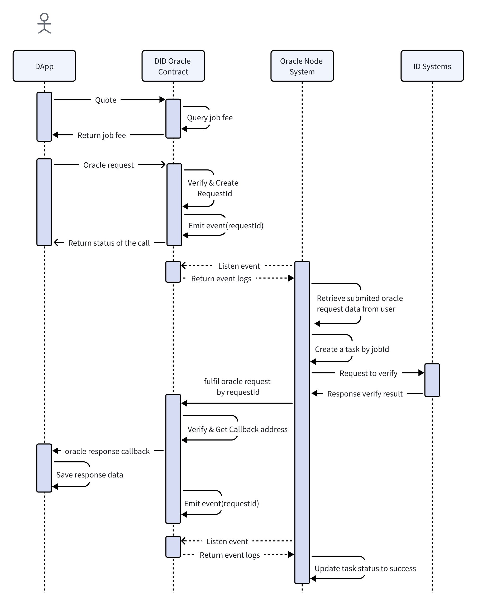

# 

[](https://webasedoc.readthedocs.io/zh_CN/latest/docs/WeBASE/CONTRIBUTING.html)
[](https://github.com/OpenDID-Labs/contracts)
[](https://github.com/WeBankBlockchain/WeBASE/releases)
[](http://www.apache.org/licenses/)
[](https://docs.openzeppelin.com/contracts)


**OpenDID Oracle合约供（应用系统）开发者通过应用合约调用，从而实现以Web3-based Oracle方式接入OpenDID。** OpenDID Oracle合约目前已分别在Ethereum Mainnet、Polygon Mainnet、Aptos Mainnet上部署，数据是相互独立的，所以我们建议您按自己的需求选择将应用合约部署在其中一条链上。以下是OpenDID Oracle合约在不同链的合约地址。

* Ethereum Mainnet：`                              `

* Polygon Mainnet：`                              `

* Aptos Mainnet：`                              `


:building_construction: **OpenDID Oracle合约内定义的接收应用合约数据的参数是`string`类型的`data`,想要了解'data'的数据结构?** 请查看OpenDID Oracle的[job数据域说明](https://github.com/OpenDID-Labs) — 包含众多ID System不同job的请求和应答参数的结构说明。

> [!IMPORTANT]
> 在OpenDID Oracle的体系内我们会将验证结果回送给您的应用合约，这一动作会涉及到 GAS 消耗，所以在OpenDID Oracle合约内我们定义了业务费，您可通过jobId查询业务费后发送验证数据。如果您在长达15分钟后还未得到验证结果，便可主动取消验证，我们会即时返还已收取的业务费。


## Table of Contents

- [Ethereum和Polygon](#Ethereum和Polygon)
    - [查询费用](#查询费用)
    - [发送验证数据](#发送验证数据)
    - [接收验证结果](#接收验证结果)
    - [取消验证请求](#取消验证请求)
- [Aptos](#Aptos)
    - [注册 UA](#注册UA)
    - [查询费用](#查询费用)
    - [发送验证数据](#发送验证数据)
    - [接收验证结果](#接收验证结果)      
- [Legal](#Legal)
- [Community](#Community)


## Ethereum和Polygon



### 查询费用
应用合约调用 OpenDID Oracle 合约的 quote 方法获取需要支付的业务费，您需在`发送验证数据`时支付这笔业务费。

```solidity
pragma solidity ^0.8.0;

function quote(bytes32 jobId) external view returns (uint256);
```

> [!WARNING]
> jobId 可通过OpenDID Oracle的[job数据域说明](https://github.com/OpenDID-Labs)查看，不同的jobID对应的费用也不相同。


### 发送验证数据

应用合约调用 OpenDID Oracle 合约的 oracleRequest 方法发送待验证的数据。OpenDID Oracle合约在收到您的请求后，会进行相应的验证并生成唯一的 requestId。

```solidity
pragma solidity ^0.8.0;

function oracleRequest(
        bytes32 jobId,
        address callbackAddress,
        uint256 nonce,
        string memory data
    ) external payable returns (bool);
```

### 接收验证结果

应用合约里面需实现 OpenDID Oracle 合约接口定义的 oracleResponse 方法，以便 OpenDID Oracle 合约可以将 requestId 对应的验证结果回送给应用合约。

```solidity
pragma solidity ^0.8.0;

function oracleResponse(bytes32 requestId, string memory data) external;
```

### 取消验证请求

_ 应用合约可以通过调用 OpenDID Oracle 合约的 cancelOracleRequest 方法取消验证。取消后我们会向`refundAddress`即时返还已收取的业务费。_

```solidity
pragma solidity ^0.8.0;

function cancelOracleRequest(
        bytes32 requestId,
        address refundAddress
    ) external returns (bool);
```    


:mage: **不确定如何开发应用合约？** 请参考以下代码。

```solidity
pragma solidity ^0.8.0;

import "../interfaces/DIDOracleRequestInterface.sol";
import "@openzeppelin/contracts/access/Ownable.sol";

contract ATestConsumer is Ownable {
    DIDOracleRequestInterface public oracle;
    uint256 public requestCount = 1;
    mapping(bytes32 => string) public results;

    event OracleRequested(bytes32 indexed requestId);
    event RequestOracleDataFulfilled(bytes32 indexed requestId);

    constructor(address oracleAddress) Ownable(msg.sender) {
        oracle = DIDOracleRequestInterface(oracleAddress);
    }

    function quote(string memory jobId) public view returns (uint256) {
        return oracle.quote(stringToBytes32(jobId));
    }

    function requestOracleData(
        string memory jobId,
        string memory data
    ) public payable {
        uint256 nonce = requestCount;
        requestCount = nonce + 1;
        emit OracleRequested(buildRequestId(nonce));
        bool flag = oracle.oracleRequest{value: msg.value}(
            stringToBytes32(jobId),
            address(this),
            nonce,
            data
        );
        require(flag, "failed to call oracle");
    }

    function cancelOracleRequest(
        bytes32 requestId,
        address refundAddress
    ) public returns (bool) {
        bool flag = oracle.cancelOracleRequest(requestId, refundAddress);
        require(flag, "failed to call oracle");
        return flag;
    }

    function oracleResponse(
        bytes32 requestId,
        string calldata data
    ) public onlyFromOracle {
        results[requestId] = data;
        emit RequestOracleDataFulfilled(requestId);
    }

    function buildRequestId(uint256 nonce) public view returns (bytes32) {
        return keccak256(abi.encodePacked(this, nonce));
    }

    function stringToBytes32(
        string memory source
    ) private pure returns (bytes32 result) {
        bytes memory tempEmptyStringTest = bytes(source);
        if (tempEmptyStringTest.length == 0) {
            return 0x0;
        }
        assembly {
            result := mload(add(source, 32))
        }
    }

    modifier onlyFromOracle() {
        require(
            address(oracle) == msg.sender,
            "Only can call via the oracle contract"
        );
        _;
    }
}
```  

## Aptos

### 注册 UA
UA 指应用合约内的任意 struct，但每个应用合约只能注册一个 UA。应用合约内可以通过以下方法注册 UA，并且保存返回的 UaCapability<UA>， 这将在后续的调用中使用。

```move
public fun register_ua<UA>(account: &signer): UaCapability<UA>;
```    

> [!WARNING]
> 必须在初始化方法中注册，这样才能验证你使用了自己合约的 UA。


### 查询费用
应用合约调用 OpenDID Oracle 合约的 get_messaging_fees 方法获取需要支付的费用。

```move
public fun get_messaging_fees(job_id: vector<u8>): u64

```

> [!WARNING]
> job_id 可通过OpenDID Oracle的[job数据域说明](https://github.com/OpenDID-Labs)，不同的job_id对应的费用也不相同。


### 发送验证数据

应用合约调用 OpenDID Oracle 合约的 oracle_request<UA> 方法发送待验证的数据。

```move
public fun oracle_request<UA>(
    job_id: vector<u8>,
    callback_address: address,
    callback_module: String,
    nonce: u64,
    data: String,
    fee: coin::Coin<AptosCoin>,
    _cap: &UaCapability<UA>
): (vector<u8>)

```

> [!WARNING]
> 必须填写接收验证结果的应用合约地址 callback_address 和模块名称 callback_module，并且指定不小于“查询费用”的 fee。


### 接收验证结果

应用合约里面需实现接收 OpenDID Oracle 回送验证结果的方法。

```move
public entry fun set_oracle_response(request_id: vector<u8>, data: String)

```

应用合约收到验证结果后，必须调用 OpenDID Oracle 合约的 receive_response<UA> 方法进行验证。

```move
public fun receive_response<UA>(request_id: vector<u8>, data: String, _cap: &UaCapability<UA>)

```

:mage: **不确定如何开发应用合约？** 请参考以下代码。

```move
module app_example::app {
    use std::option;
    use std::option::Option;
    use did_oracle::oracle::{Self,UaCapability};
    use std::string::{Self, String};
    use aptos_std::simple_map;
    use aptos_framework::aptos_coin::AptosCoin;
    use aptos_framework::coin;

    struct OracleUA {}

    #[resource_group_member(group = aptos_framework::object::ObjectGroup)]
    struct AppMetaData has key {
        nonce: u64,
        request_ids: simple_map::SimpleMap<u64, vector<u8>>,
        oracle_call: simple_map::SimpleMap<vector<u8>, OracleCallData>,
        cap:UaCapability<OracleUA>,
    }

    struct OracleCallData has store {
        call_back: bool,
        call_fee:u64,
        request_data: String,
        response_data: option::Option<String>
    }

    fun init_module(signer: &signer) {
        let cap = oracle::register_ua<OracleUA>(signer);

        move_to(
            signer,
            AppMetaData {
                nonce: 0,
                request_ids: simple_map::create(),
                oracle_call: simple_map::create(),
                cap,
            }
        );
    }

    #[view]
    public fun get_oracle_call(nonce: u64): (vector<u8>, bool, String, Option<String>) acquires AppMetaData {
        let metadata = borrow_global_mut<AppMetaData>(@app_example);

        assert!(simple_map::contains_key(&metadata.request_ids, &nonce), 404);
        let request_id = simple_map::borrow(&metadata.request_ids, &nonce);

        let oracle_call = simple_map::borrow(&metadata.oracle_call, request_id);

        (*request_id, oracle_call.call_back, oracle_call.request_data, oracle_call.response_data)

    }

    public entry fun call_oracle(account:&signer,job_id:vector<u8>,data: String) acquires AppMetaData {
        let module_id = string::utf8(b"app");

        let job_fee_amount = oracle::get_messaging_fees(job_id);

        job_fee_amount = job_fee_amount + (job_fee_amount/10)*2;

        let job_fee = coin::withdraw<AptosCoin>(account,job_fee_amount);


        let metadata = borrow_global_mut<AppMetaData>(@app_example);

        let request_id = oracle::oracle_request<OracleUA>(job_id, @app_example, module_id, metadata.nonce, data,job_fee,&metadata.cap);

        simple_map::add(&mut metadata.request_ids, metadata.nonce, request_id);

        simple_map::add(
            &mut metadata.oracle_call,
            request_id,
            OracleCallData { call_back: false, call_fee:job_fee_amount,request_data: data, response_data: option::none() }
        );

        metadata.nonce = metadata.nonce + 1;
    }

    public entry fun set_oracle_response(request_id: vector<u8>, data: String) acquires AppMetaData {
        let metadata = borrow_global_mut<AppMetaData>(@app_example);

        oracle::receive_response<OracleUA>(request_id, data,&metadata.cap);

        if (simple_map::contains_key(&metadata.oracle_call, &request_id)) {
            let call_data = simple_map::borrow_mut(&mut metadata.oracle_call, &request_id);
            call_data.call_back = true;
            call_data.response_data = option::some(data);
        }
    }

    #[test_only]
    public fun init_for_test(signer: &signer) {
        init_module(signer);
    }
}
```

## Legal

Your use of this Project is governed by the terms found at www.opendid.io (the "Terms").

## Community
Contact us: contact@opendid.io

Website: www.opendid.io
